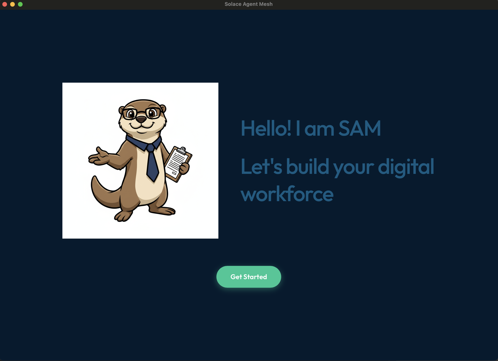
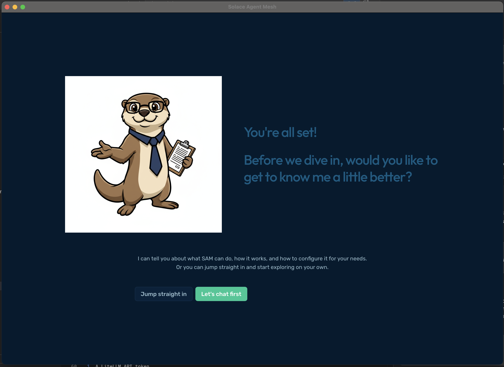

# SKO Workshop

This repo is the hands-on workspace for the SKO workshop. It contains the
declarative SAM configuration and step-by-step guides you will follow during
the session.

## Table of Contents

- [Environment Setup](#environment-setup)
  - [Prerequisites](#prerequisites)
  - [If using Docker solace broker: Add the Solace Broker to the Docker Network](#if-using-docker-solace-broker-add-the-solace-broker-to-the-docker-network)
- [Getting Started](#getting-started)


## Environment Setup

### Prerequisites
All required executables will be shared the day of the workshop. There are executables for Client, CLI, and Docker; choose the appropriate endpoint.

1. SAM Client (in the client folder, install the OS target)
    1. SAM Desktop executable: SolaceAgentMesh.dmg or sam-desktop-enterprise.exe
        > Note: On MacOS, after dragging the app to your Applications execute the following:
        ```bash
        xattr -cr /Applications/Solace\ Agent\ Mesh.app
        ```
        > Note: On Windows, if your .exe does not load run the following from Powershell
        ```bash
        Start-Process .\sam-desktop-enterprise.exe
        ```

        

        Follow the steps to configure SAM Desktop:
        - Get Started
        - Configure a model now
        - Enter LiteLLM key manually
        - From "Service" Choose `Custom` as service type
        - Put `https://lite-llm.mymaas.net/` as endpoint then click "Looks good"
        - Choose `claude-sonnet-4-6` as the model
        - Test connection and make sure you get a success
        - Choose built-in

        

    1. OR The `sam-enterprise` Docker image loaded locally
        ```
        docker load -i sam-enterprise-latest.tar.gz
        docker compose up
        ```
        > Note: you can use podman instead
1. SAM cli installed in a dedicated dir from one drive 
    > Note: make sure you do not have any `sam` command installed on your system
    > To confirm, open a terminal session and just type `sam` you should see no command found
    
    ```bash
    cd <path_to_dir_where_cli_installed>
    # Make sure the executable is called sam
    # Note: Replace the executable name to match what you installed
    mv sam-enterprise sam
    # MacOS / Linux / WSL
    chmod +ux sam
    xattr -cr sam

    # Make sure to add the sam cli to your path
    # For Windows, follow note below
    export PATH=$PATH:$PWD
    # Open new terminal and confirm sam -v works
    ```
    > Note: to make sure the sam cli is executable in every terminal session, update your .profile (e.g. ~/.zshrc)

    ```
    echo "export PATH=$PATH:$PWD" >> ~/.zshrc 
    ```
    **On Windows**
    - System Properties > Environment Variables > in System Variables edit the Path variable. Add New variable and include the dir where sam.exe is.
    - Note: you can test it in a new terminal session
1. A LiteLLM API token
1. [VsCode](https://code.visualstudio.com/download) (or any code editor with an ai-assisted tool)
1. [Claude Code installed](https://code.claude.com/docs/en/quickstart) (`claude --version`) [and configured](https://sol-jira.atlassian.net/wiki/spaces/EngPlat/pages/5904760882/Claude+Code+-+Instructions+and+FAQ)
1. [Optional] Solace Broker
    1. Docker with a running Solace broker container attached to the `sam-network` bridge network
    1. OR you can use Solace Cloud instead

### If using Docker solace broker: Add the Solace Broker to the Docker Network

If not already, get the solace broker running locally

The SAM container must reach the Solace broker by container name (`solace`). Both must be on the same Docker bridge network:

```bash
# Create the shared network if it does not exist
docker network create sam-network

# If your Solace broker container is already running, connect it
docker network connect sam-network solace
```

## Getting Started

Follow the guides in the guides directory, starting with

1. [Getting Started](guides/100_Getting_Started.md)
1. [Hiring](guides/200_Hiring.md)
2. [Onboarding](guides/300_Onboarding.md)
3. [Coaching](guides/400_Coaching.md)
4. [Supervision](guides/500_Supervision.md)
5. [Teamwork](guides/600_Teamwork.md)
6. [Improvement](guides/700_Improvement.md)
