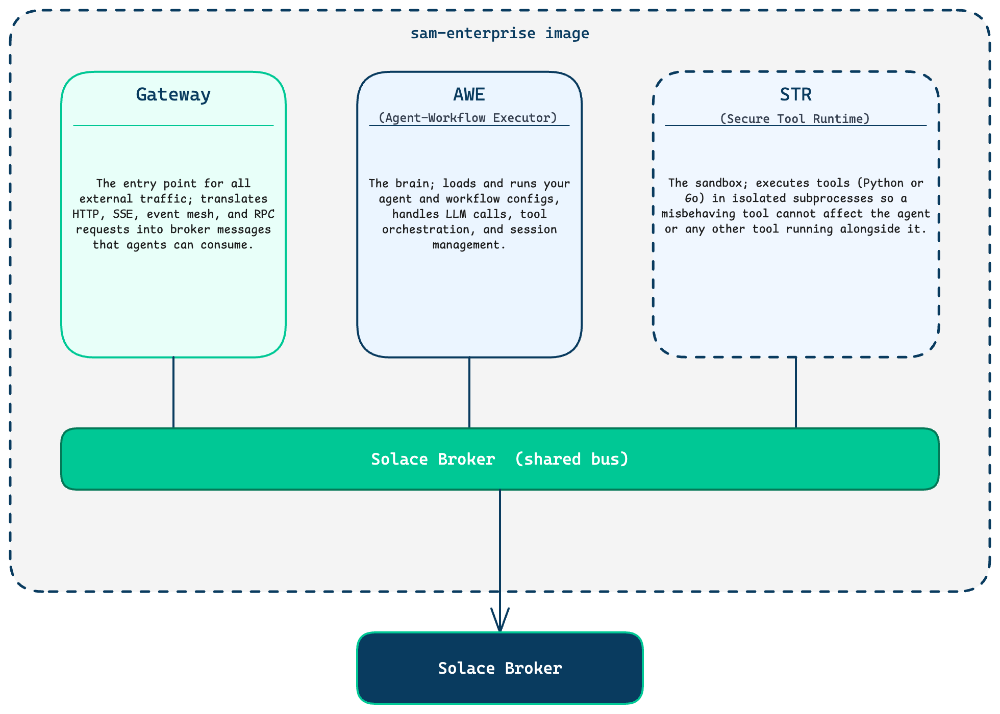
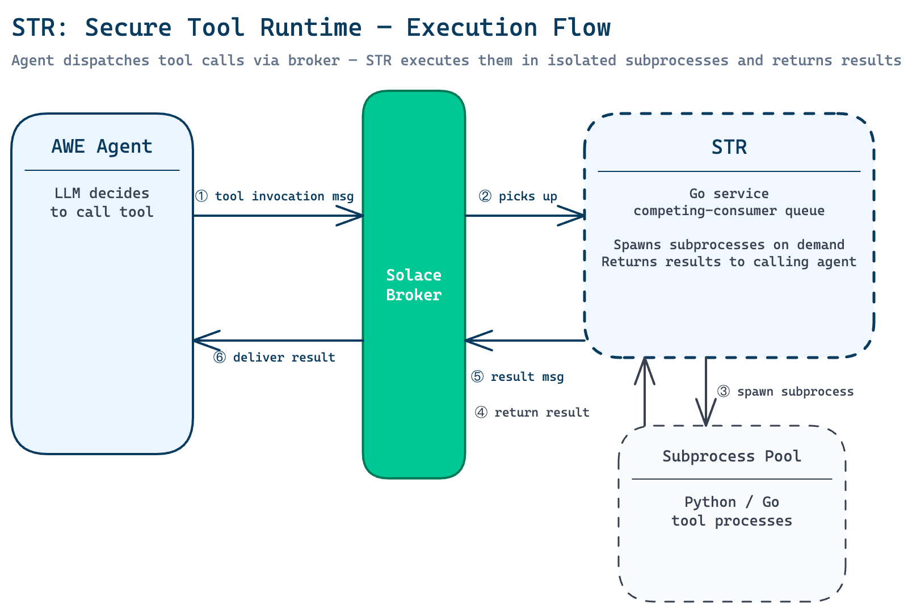
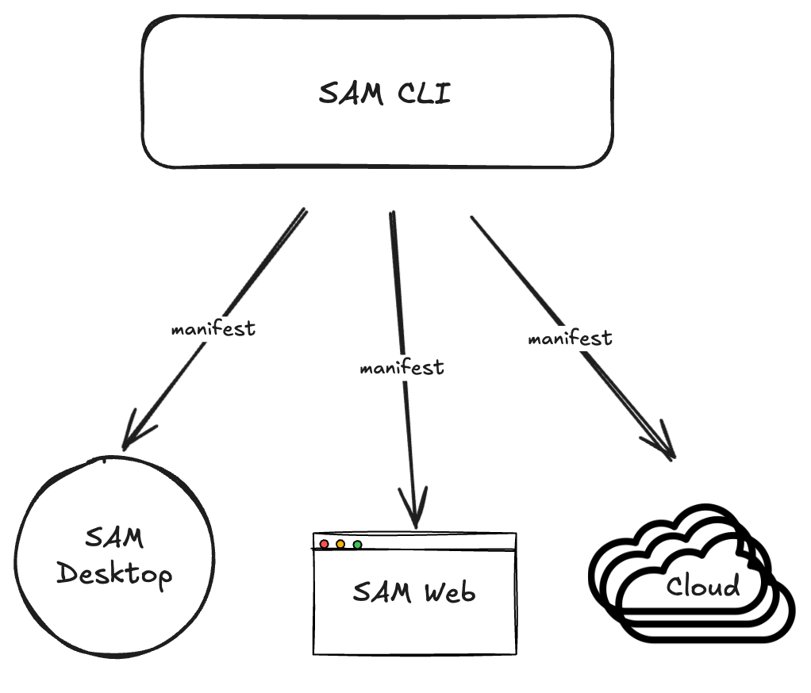

# Getting Started

Welcome to the SKO workshop. This guide walks you through standing up your local SAM environment and applying the starter configuration. We also cover the new Go-based architecture in enough depth to understand what is running and why it is designed the way it is.

---

## Table of Contents

- [Update .env](#update-env)
- [Create directory](#create-a-working-directory)
- [Install the SAM skills](#install-the-SAM-skills)
- [Start the SAM Stack](#start-the-sam-stack)
- [The New SAM Architecture](#the-new-sam-architecture)
  - [Component Overview](#component-overview)
  - [AWE: Agent-Workflow Executor](#awe-agent-workflow-executor)
  - [STR: Secure Tool Runtime](#str-secure-tool-runtime)
  - [Gateway](#gateway)
  - [SAM CLI](#sam-cli)
  - [Declarative SAM — `sam config apply`](#declarative-sam--sam-config-apply)
  - [No ADK — What Changed](#no-adk--what-changed)
- [Back to Workshop Exercise](#back-to-workshop-exercise)

---

## Update .env

1. Create a .env file with the following basic vars
    ```
    # LLM — LiteLLM proxy at mymaas.net
    LLM_SERVICE_ENDPOINT="https://lite-llm.mymaas.net/"
    MODEL_GENERAL_API_KEY="sk-<>"
    MODEL_PLANNING_API_KEY="sk-<>"
    ```
    > Note: You can just copy the example env if you cloned this repo `cp .env_example .env`
1. Update the necessary vars

## Create a working directory

```bash
mkdir sko_bootcamp
cd sko_bootcamp
# open in VSCode
code .
```

## Install the SAM skills

```bash
# Install the SAM skill into Claude Code
sam skill install

# Verify the installed version matches the CLI
sam skill check
```

## Start the SAM Stack

1. Launch the SAM Desktop app
1. OR run the following docker command

  ```bash
  # From this directory
  docker compose up
  ```

  The container exposes two ports:
  - **8000** — SAM UI and the Gateway API (agent requests go here)
  - **8001** — Platform API (health, config, deployment)

  The health check hits `http://localhost:8001/api/v1/platform/health`. Once it returns 200, SAM is ready.

## The New SAM Architecture - mindset shift!

The decision to re-architect Agent Mesh and rewrite it in Go (two independent decisions that happened to be made together) was driven by real technical pain: 
1. One process or K8S pod per agent/workflow/a2a-proxy was unnecessarily expensive
1. Adding new agents in a K8S deployment was slow and combersome
1. Very difficult to add new custom tools in a secure way
1. Overall performance and scalability was insufficient for an enterprise solution
1. Python was the wrong tool for the job - it has poor concurrency performance, no true static typing and a higher attack surface
1. Go is the new language of enterprise integration - fast, highly-concurrent, multi-platform and more secure

The new architecture was originally planned in Python. Go was adopted separately as an experiment that proved itself superior, and it became the obvious choice.

### Component Overview
SAM is now composed of 3 separate runtimes:

> [!CAUTION]
> You will almost never be interacting with these runtimes directly, this is just for those who are curious to know what's happening underneath the hood




- **Gateway** -- the entry point for all external traffic; translates HTTP, SSE, event mesh, and RPC requests into broker messages that agents can consume.
- **AWE (Agent-Workflow Executor)** -- the brain; loads and runs your agent and workflow configs, handles LLM calls, tool orchestration, and session management.
- **STR (Secure Tool Runtime)** -- the sandbox; executes tools (Python or Go) in isolated subprocesses so a misbehaving tool cannot affect the agent or any other tool running alongside it.

---

### AWE: Agent-Workflow Executor

### What It Is

AWE is the single Go binary that loads and runs N agent configurations and M workflow configurations simultaneously. It is a **host process**, not a framework. Think of it as a supervisor that shares one set of expensive infrastructure (broker connection, LLM client, artifact service, session store) across every agent running inside it.

### What "Stateless" Means

AWE instances are stateless in the operational sense: no conversation state, no session data, and no tool schemas live inside the AWE process memory in a way that must survive a restart. Specifically:

- **Conversation history** is stored in the session backend (Redis or SQL), keyed by session ID. Any AWE restart reloads it from there.
- **Agent configuration** is reloaded from YAML files on startup. There is no in-memory config that diverges from what is on disk.
- **Tool schemas** are re-broadcast by the STR on every startup (and every 60 seconds thereafter), so agents rediscover available tools automatically.
- **Durable broker queues** persist across restarts because they live in the broker, not the AWE process.

This means you can restart, redeploy, or horizontally scale AWE instances without losing user sessions or tool availability.

### Concurrency

AWE uses Go's concurrency primitives throughout:

- Each instance has a **message receiver goroutine** that reads from its broker queue and applies flow control
- Each incoming request gets its own **request goroutine** (bounded by flow control)
- Tool calls within a request can run in parallel (each gets its own goroutine)
- Shutdown uses a `sync.WaitGroup` across all instances so the process waits for every in-flight request to complete before exiting

---

### STR: Secure Tool Runtime

### What It Is

STR is the subprocess pool that executes Python and Go based tools. It is a Go service that listens on a competing-consumer queue, spawns tool subprocesses on demand, and returns results to the calling agent.

When an agent's LLM decides to call a tool (Python or Go), the agent publishes a tool invocation message to the broker. The STR picks it up, executes the appropriate Python subprocess, and publishes the result back. The agent never executes Python directly.



### Why This Matters

Before the Go rewrite, tool code ran inside the same Python process as the agent. This meant:

- A misbehaving tool could crash the entire agent
- CPU-intensive tools (image processing, document parsing) blocked the agent's event loop
- Tool cold-start overhead (~5 seconds of ADK import time) affected every session

Now tools run as isolated subprocesses with optional Linux namespace sandboxing (bubblewrap/bwrap). They are killed cleanly when the agent's request times out.

---

### Gateway

### What It Is

Gateway is the component that connects external systems to SAM agents. It translates external protocols and event sources into A2A (Agent-to-Agent) messages that agents understand, and it routes agent responses back out.

---

### SAM CLI

### Overview

The SAM CLI (`sam`) is the primary tool for managing a SAM deployment. It covers everything from starting a local dev instance to applying declarative configuration to a remote platform.

### Command Reference

```
sam run            Start SAM locally (subprocess mode or --embedded all-in-one mode)
sam task           Send a one-shot task to a running agent
sam eval           Run evaluations against agent configs
sam docs           Open documentation
sam control        Send control commands to running AWE instances
sam volume         Manage artifact volumes
sam str            Manage STR (tool runtime) instances
sam config         Declarative configuration management (primary workflow)
  sam config apply   Apply a manifest to a SAM platform (reconcile declared vs actual)
  sam config plan    Preview what apply would do (dry run with diff output)
  sam config pull    Pull current platform state into local YAML files
  sam config refresh Refresh cached resource definitions from the platform
  sam config migrate Migrate legacy config formats to current schema
  sam config schema  Print the JSON schema for a resource kind
  sam config cache   Manage the local config cache
sam toolset        Manage toolsets (publish, list, install)
sam skill          Manage skills
  sam skill install  Write SKILL.md to .claude/skills/ for Claude Code integration
  sam skill check    Verify installed skill version matches CLI version
sam auth           Authentication management
sam api            Direct API calls to the SAM platform
```

> [!TIP]
> We will almost never be calling these commands directly from the cli. The SAM skills houses detailed documentation of all of this, and hence, we will only be using AI-assisted tools to interact with sam cli

### sam run — Starting SAM Locally [SKIP THIS IF YOU ARE RUNNING VIA DOCKER OR DESKTOP APP]

```bash
# Standard subprocess mode (separate AWE, STR, Gateway subprocesses)
sam run

# All-in-one embedded mode (in-process DevBroker, no subprocesses)
# Useful for development — no Solace broker needed
sam run --embedded

# Expose the in-process DevBroker on a TCP port so external STR containers can connect
sam run --embedded --network-broker-port 55554
```

The `--embedded` flag starts an in-memory DevBroker and runs everything in one process. This eliminates the Solace broker dependency for local development.

---

### Declarative SAM — `sam config apply`

### What It Is

Declarative SAM is the workflow for defining your entire SAM deployment as YAML files and letting the CLI reconcile the actual platform state against your declared tenant. It works similarly to `kubectl apply` or Terraform: you describe what you want, the CLI figures out what needs to change.

The diagram below shows the core power of this model. A single `sam config apply` command, pointed at a manifest, drives configuration across every SAM deployment target simultaneously -- SAM Desktop for local development, SAM Web for shared environments, and Cloud for production. The manifest is the single source of truth; the CLI handles the differences between targets.



This same mechanism extends to **broker resource provisioning via SEMP** (Solace Element Management Protocol). When you declare agents, gateways, and connectors in a manifest, the CLI does not just push YAML to the SAM platform, it also calls the Solace broker's SEMP API to provision the durable queues, topic subscriptions, ACL profiles, and client usernames that those components need. Infrastructure that previously required manual broker configuration or separate Terraform modules is now fully captured in the same manifest file as your agent config.

### The Manifest File

A manifest is a YAML file with `kind: manifest` that declares what resources your deployment needs. The workshop manifest is at `config/manifests`:

```yaml
kind: manifest
name: sko-workshop-dev
description: SKO workshop — declarative config for the local SAM instance.
target:
  url: http://localhost:8000
resources:
  models:
    - general
    - planning
  toolsets: []
  connectors: []
  agents: []
  gateways: []
  workflows: []
```

**Key manifest concepts:**

- **`target`** — the SAM platform URL being configured (can be overridden with `--target` flag)
- **`resources`** — what the platform should have. Entries can be bare names (`general`), source-qualified (`general@myrepo`), or aliased (`{from: gpt4-model@corp-repo, as: general}`)
- **Sources** (optional) — named registries of reusable resources (toolsets, model configs, connector templates)
- **`platform` block** (optional) — declares platform-level wiring like the profile-provider toolset for post-auth enrichment

### The Two-Phase Apply Workflow

`sam config apply` runs in two phases:

1. **Config sync** — pushes resource definitions to the platform via REST API (PUT/POST/DELETE as needed). This is a pure declarative reconciliation: resources in the manifest are created or updated, resources on the platform not in the manifest are deleted (if `--prune` is set).

2. **Deployment** — triggers the platform to deploy the synced config to the running AWE instances. Skip this phase with `--no-deploy` to stage config changes without activating them.

> [!TIP]
> Again, We will almost never be calling these commands directly from the cli. The SAM skills houses detailed documentation of all of this, and hence, we will only be using AI-assisted tools to interact with sam cli

### Useful Flags

| Flag | Description |
|---|---|
| `-m / --manifest` | Path to manifest file |
| `--target` | Override the platform URL from the manifest |
| `--dry-run` | Validate and preview without making API calls |
| `--prune` | Delete platform resources not in the manifest |
| `--no-deploy` | Sync config but skip the deployment phase |
| `--no-cache` | Force re-fetch all resource schemas from platform |
| `--verbose / -v` | Show detailed diff output |
| `--allow-floating-refs` | Allow manifest entries that reference unresolvable sources |

### Using AI to Write Declarative Config

The recommended workflow for authoring agent and workflow configs is to use Claude Code with the SAM skill installed.

```bash
# Install the SAM skill into Claude Code
sam skill install

# Verify the installed version matches the CLI
sam skill check
```

Once the skill is installed, Claude Code knows the full schema for every SAM resource kind (agents, workflows, models, connectors, toolsets). You can prompt it to generate or modify your manifest and it will produce valid, schema-correct output.

Example prompts:
- "Create an agent config for a customer support agent that has access to the knowledge_base toolset and uses the general model"
- "Add a sub-task to my orchestrator agent that delegates data collection to a fresh session"
- "Write a workflow that takes an incoming event and routes it to three parallel agents based on event type"

---
### Anti-patterns and Best Practices

- Agents == Employee --> == employee has a whole set of tools. E.g. project mgmr employee that has ACCESS to tools
- More skills. Less agents. Every “agent/employee” loads on demand the tools it needs

---

### No ADK — What Changed

### What Was Removed

The previous Python SAM used ADK as the LLM interaction and tool-calling framework. ADK pulled in a large dependency chain: `google-adk`, `solace-pubsubplus`, `onnxruntime`, `pydub`, SQLAlchemy, and more.

This caused:
- **~5 second cold import time** on every tool subprocess start (the ADK was re-imported each time)
- **Large container images** due to binary ML library dependencies
- **Inflexibility** — the ADK's built-in session management and tool loop could not be easily adapted to SAM's broker-based architecture
- **Deadlocks and memory leaks** — Python's threading model and the GIL caused instability under concurrent load

### What Replaced It

**For the agent/workflow core:** The LLM interaction loop, tool calling semantics, and conversation management are now implemented natively in Go. This runs inside AWE with no Python dependency.

**For Python tool authors:** A minimal Python package called `sam-tool-sdk` replaces the full `solace_agent_mesh` import. It has exactly one dependency: `pydantic >= 2.0`. 

---

## Agent Development Lifecycle


The Agent Development Lifecycle (ADLC) is a six-stage framework for conceiving, building, deploying, governing, and continuously improving AI agents in the enterprise. It draws on lessons from both the software development lifecycle (SDLC) and the human employee lifecycle. Each stage addresses a distinct challenge:
1. defining what an agent does (Hiring), giving it the right access (Onboarding),
1. validating that it performs correctly (Coaching),
1. maintaining human oversight (Supervision),1.
integrating it into a team of agents (Teamwork), and
1. keeping it improving over time (Improvement). 

Every stage of the ADLC maps directly to features in Solace Agent Mesh from the agent builder and skill system that support role definition, to connectors and gateways for access provisioning, to evals and telemetry for performance monitoring.

This workshop walks through every stage of the ADLC hands-on. Each guide covers what the stage means in practice and which SAM features you'll use to implement it.

---

## Back to Workshop Exercise [Skip if running from scratch]

With your SAM client up and running, prompt CC to scaffold a folder structure for sam

```
Using the sam cli, scaffold a folder structure for a local instance of sam desktop running on http://localhost:8000 with no authentication. Then pull any configuration on that instance to update local manifest and setup
```

Then open the SAM UI at `http://localhost:8000` and start a conversation with `sam`.

Once you are comfortable with the basics, use `sam skill install` and ask Claude Code to help you extend the agent — add tools, change the system prompt, or wire up a connector.

## Hiring
[Get started with Hiring phase](./200_Hiring.md)
