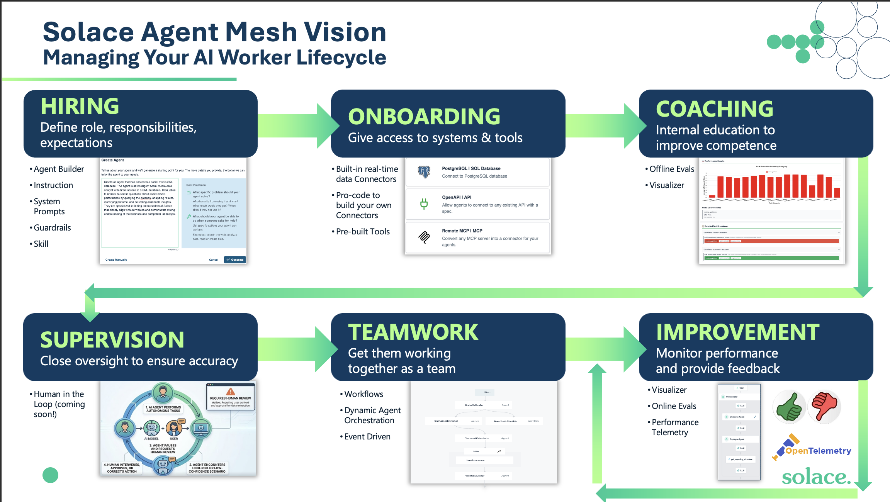

# ADLC Background

This document covers the Agent Development Lifecycle (ADLC): what it is, why it exists, and how Solace has adopted and positioned it. It is background reading for anyone working with SAM, pitching to customers, or delivering post-sale engagements. The workshop guides that follow each map to a stage of the ADLC.

## Table of Contents

- [Agent Development Lifecycle](#agent-development-lifecycle)
- [Why do we need an ADLC](#why-do-we-need-an-adlc)
- [ADLC at Solace](#adlc-at-solace)
  - [Why It Matters to Solace](#why-it-matters-to-solace)
  - [Positioning It With Customers](#positioning-it-with-customers)
  - [Industry Context](#industry-context)

---

## Agent Development Lifecycle

The Agent Development Lifecycle (ADLC) is a six-stage framework for conceiving, building, deploying, governing, and continuously improving AI agents in the enterprise. It draws on lessons from both the software development lifecycle (SDLC) and the human employee lifecycle. Each stage addresses a distinct challenge:
1. defining what an agent does (Hiring), giving it the right access (Onboarding),
1. validating that it performs correctly (Coaching),
1. maintaining human oversight (Supervision),1.
integrating it into a team of agents (Teamwork), and
1. keeping it improving over time (Improvement). 

Every stage of the ADLC maps directly to features in Solace Agent Mesh from the agent builder and skill system that support role definition, to connectors and gateways for access provisioning, to evals and telemetry for performance monitoring.

This workshop walks through every stage of the ADLC hands-on. Each guide covers what the stage means in practice and which SAM features you'll use to implement it.

## Why do we need an ADLC

Good engineering requires a repeatable process. Agents introduce a new class of software that existing lifecycles do not cover.

The software industry has adapted its methodology each time a new paradigm required it:

- **SDLC** (early 1980s) — structured the process for deterministic, rule-based software
- **API Development Lifecycle** (Mulesoft, ~2013) — addressed the unique challenges of building integration-first software
- **ADLC** (2025/2026) — addresses AI agents, which are fundamentally non-deterministic

Agents behave differently from traditional software. The same input can produce different outputs. Testing a boolean condition is not sufficient. An agent can pass all unit tests and still give a user a wrong answer in production. A new methodology is required to handle this.

The ADLC gives development teams a structured, repeatable, quality-based way to build and operate agents at enterprise scale.

## ADLC at Solace

The ADLC is not a Solace invention. It is an industry-emerging term adopted by LangChain, Mulesoft, IBM, and others. Solace has defined its own version of it, shaped by the specific challenges of building enterprise-grade, event-driven agent systems.

### Why It Matters to Solace

The ADLC serves three distinct audiences inside Solace:

1. **Product**: The ADLC is the north star for our product roadmap. Every SAM feature maps to a stage. When we evaluate what to build next, we ask which ADLC stage it strengthens.

1. **Sales**: The ADLC is our pitch framework. Instead of leading with features, we walk customers through the journey they will experience. We identify where they are, highlight the challenges ahead, and show how SAM addresses each one. An agent harness like LangGraph or DeepAgent is not enough. The ADLC makes that point in context.

1. **Professional Services (PSG/JEDAI)**: The ADLC is the technical methodology PSG uses post-sale. It gives delivery teams a shared language and a structured path from first agent to production-grade deployment.

### Positioning It With Customers

Use the ADLC to meet customers where they are. It allows you to discuss features and differentiators relative to their maturity rather than as an abstract list. A customer who is still defining what their first agent should do has different needs than one already running agents in production and asking about governance.

Key points to make in customer conversations:

- An ADLC is critical to successfully deploying agents at enterprise scale. Without a structured lifecycle, agents get built ad-hoc, fail to reach production, or create risk once they are there.
- The ADLC guides what customers need to do at each step, what challenges they will face, and how SAM helps them through it.
- The ADLC demonstrates that Solace is aligned with the customer's journey, not just selling a product.
- This is the SAM equivalent of Solace's broader narratives (Liberate, Stream and Filter, React, Democratize) applied to the agent space.

### Industry Context

The ADLC concept is gaining traction across the industry. LangChain, Mulesoft, and IBM have each published their own versions. This is not a niche idea. It reflects a genuine industry consensus that agent development requires its own methodology.

Solace's version is differentiated by its focus on enterprise integration, event-driven architecture, and the operational concerns (governance, security, scalability) that matter at the scale our customers operate at.

The ADLC will evolve as the industry matures. It is a living framework, not a fixed spec.

---

## Next: Start the ADLC

Now that you understand the framework, begin with the first stage.

[Stage 1: Hiring](./200_Hiring.md) — define what your agent does, who it serves, and what role it plays.