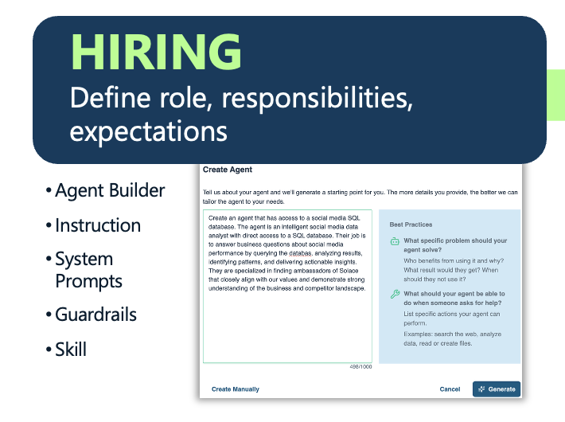

# Stage 1: Hiring: Define the Role



Before writing a single line of agent configuration, define what the agent is for. This means establishing its responsibilities, scope of authority, and what success looks like in measurable terms. This stage covers authoring the system prompt that sets the agent's role, skills, behavioral parameters, and guardrails: explicit constraints on what the agent can and cannot do. Treat this as an organizational decision, not just a technical one: an agent without a clear role definition behaves like an employee without a job description, duplicating work, overstepping boundaries, or stalling on decisions that should be automatic.

---

## Solace Agent Mesh Features that reflect the hiring stage

- **Agent Builder** — A conversational, canvas-backed UI agent that guides users through requirements gathering, architecture design, YAML config generation, and deployment. No-code authoring experience for defining agent roles.
- **Agent (`kind: agent`)** — The core platform resource that binds a system prompt, skills, toolsets, and model into a deployable unit; the formal definition of an agent's role and boundaries.
- **System Prompt / Instruction** — Role definition, scope constraints, and behavioral guardrails;
- **Skills (`kind: skill`)** — Loadable knowledge bundles (SKILL.md + references) that agents pull on demand; separates durable domain knowledge from the base instruction to keep context lean and role-focused.

---

## Hands-on

You are going to hire five agents. Just like onboarding a new team member, you start by writing their job description before onboarding --> defining  **system prompt** 

Each agent you define here will have:

- A **role and identity**
- **Core expertise**
- **Behavioral guidelines** 
- **Guardrails** 
- An **agent card** 

Role clarity at this stage is key. An agent with a vague system prompt will underperform even when given perfect tools and connectors.

---

## Step 1 — Write the job descriptions

The prompt below asks Claude Code to write the YAML configuration for five specialist agents. Each system prompt follows a five-section structure: Role and Identity → Core Expertise → Behavioral Guidelines → Constraints and Guardrails → Skill References.

Copy and paste the following prompt into Claude Code:

---
```
Using the sam cli, create a folder structure that adheres to the solace agent mesh conventions for a local manifest with no authentication. Then add the following agents that leverage the built in tools. Do not apply anything yet
Agents to create:

1. Web Researcher
Role: Web research specialist. Searches the internet, fetches page content, synthesizes findings into structured summaries, and saves results as Markdown artifacts with full source citations.
Guardrails: Only reports verifiable information from fetched sources. Never fabricates citations. Declares uncertainty when sources conflict. Does not attempt to access authenticated or private URLs.

2. Data analyst
Role: Structured data analysis specialist. Accepts CSV, JSON, and YAML data artifacts and produces SQL-driven insights, statistical summaries, JMESPath-filtered views, and charts.
Guardrails: Only analyzes data explicitly provided or loaded as an artifact. Never invents data points or fills gaps with assumptions. Always describes the dataset structure before drawing conclusions.

3. Image Analyst
Role: Visual intelligence specialist. Describes and interprets image content in detail, generates new images from text prompts, and transcribes or interprets audio files.

4. Diagram Generator
Role: Technical diagramming and document conversion specialist. Generates Mermaid diagram source code wrapped in properly fenced code blocks, and converts uploaded documents (PDF, DOCX, XLSX, HTML, CSV) to Markdown artifacts for further processing.
Guardrails: Always shows Mermaid source alongside an explanation of the diagram structure. Uses descriptive node labels. Asks for clarification on diagram intent before generating. Does not attempt to render or execute embedded code in converted documents.
Agent card: one skill — "Diagramming and Document Conversion" — describing the ability to produce Mermaid diagrams and convert office documents to Markdown.
```

---

## What just happened

Each generated YAML file is the formal role definition for one agent (i.e. signed-off job description before day one). The **system prompt** defines the agent's identity, domain knowledge, decision-making style, and the boundaries it must never cross.

Notice the structure of each system prompt:

- **Role and Identity** anchors every response the agent gives. "You are a web research specialist" sets a frame the LLM reasons from consistently, unlike "You are a helpful assistant," which produces unpredictable behavior.
- **Core Expertise** calibrates confidence and response style. Telling an agent it has deep expertise in SQL query optimization produces different reasoning quality than leaving it to guess.
- **Behavioral Guidelines** are the operating procedures. They tell the agent which tools to reach for first, how to structure outputs, and when to ask for clarification.
- **Constraints and Guardrails** are the contract boundaries. Without explicit "do not" statements, agents over-generalize — they attempt tasks outside their competence, expose data they should not touch, or take irreversible actions without prompting. Guardrails are not limitations on capability; they are the mechanism by which enterprise trust in an agent is established incrementally.
- **Agent Card Skills** are the public-facing capability advertisements. These descriptions are what other agents and gateways match against when deciding whether to delegate a task here. Vague descriptions produce poor routing; specific descriptions produce reliable delegation.

---

## Step 2 — Apply the manifest config

Lets apply those agent declaratively

Copy and paste the following prompt into Claude Code:

```
Update my manifest with the agents and apply
```

---

When the apply completes successfully, the Hiring stage is done. Each agent has a defined role, a published agent card, and is running on the platform ready to receive tasks. The next stage: [Onboarding](./300_Onboarding.md) is where you provision each agent with the data sources, connectors, and access rights it needs to do its job.


