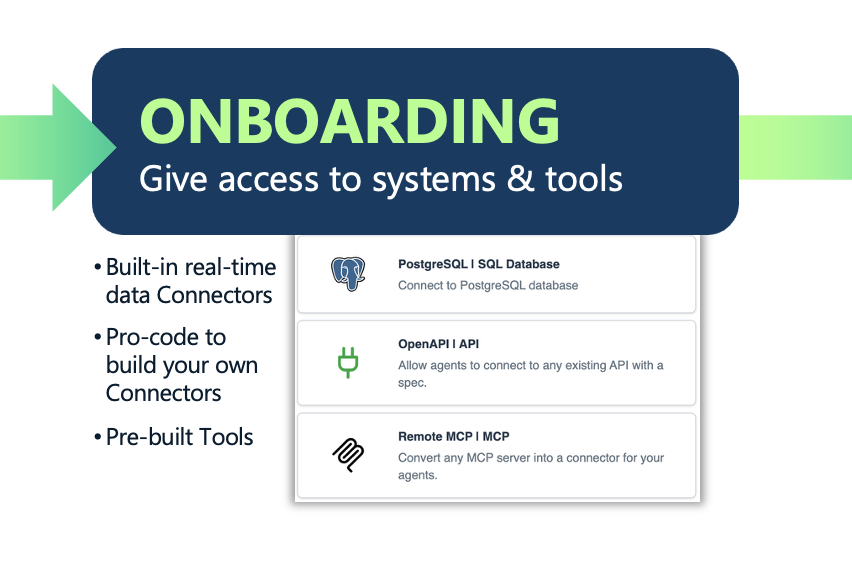

# Stage 2: Onboarding — Provision Access

Once the role is defined, connect the agent to the systems and data sources it needs to perform it. This is the direct analog to provisioning a new employee with tools, credentials, and access rights on day one. For AI agents, onboarding covers connectivity to enterprise databases via SQL, enterprise applications via APIs, MCP servers, and third-party agents via A2A protocols — as well as defining how the agent is triggered (chat, event, API call, or from another agent). Getting onboarding right means providing the right access, not just any access. Apply the principle of least privilege: role-based access controls, SSO, and delegated identity ensure each agent operates only within the permissions appropriate to its defined function.

---

## Solace Agent Mesh Features

- **SQL Connector** — Provides agents with query access to relational databases (PostgreSQL, MySQL, MariaDB).
- **MCP Connector** — Connects agents to any Model Context Protocol server via streamable-HTTP or SSE transport, exposing its tools natively to the agent.
- **API Connector (OpenAPI)** — Connects agents to any REST API described by an OpenAPI spec, with auto-detected authentication.
- **Knowledge Base Connector** — Wires agents to a managed vector knowledge base (Amazon Bedrock KB) for retrieval-augmented generation.
- **Toolsets** — Named, pre-packaged groups of built-in tools attached to agents: `artifact_tools`, `web_request_tools`, `file_tools`, `image_tools`, `time_tools`, `human_in_loop_tools`.
- **MCP Tools** — Tools exposed by external MCP servers (stdio, SSE, or streamable-HTTP) attached to an agent and discoverable at runtime.
- **HTTP SSE Gateway** — The platform-managed chat-and-streaming gateway that exposes agents to users via Server-Sent Events; handles session management, auth, and response streaming.
- **Event Mesh Gateway** — An event-driven connector that subscribes to Solace broker topics and routes real-world events (webhooks, IoT, queue messages) into agent tasks.
- **Proxy (`kind: proxy`)** — Connects external A2A-over-HTTPS agents into the mesh; handles agent card fetching, auth (static bearer / API key / OAuth 2.0), and artifact format translation.
- **RBAC (`authorization_service: default_rbac`)** — Role-based access control using YAML-defined roles and users; enforced at tool dispatch, peer delegation, and control-plane operations.
- **IdP Claims Mapping (`idp_claims_config`)** — Maps identity-provider group claims (e.g., OIDC `groups`) to SAM roles at authentication time, enabling SSO-driven access provisioning.
- **Session Memory (`session_service`)** — Configurable persistence backend (in-memory, SQLite, PostgreSQL) that stores conversation history and task checkpoints per agent.
