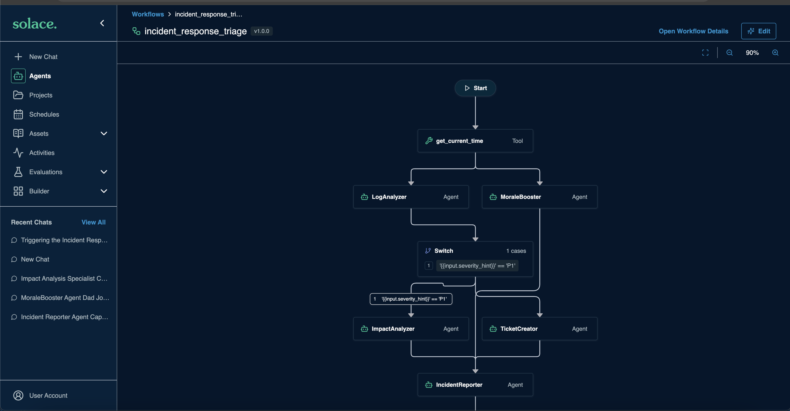

# SAM Workflows Workshop
In this section we you will get to learn how to use declarative sam to pull configuration from a remote instance

## Clear SAM

```
using the local manifest, clear all resources on my local instance of sam desktop
```

## Pull configuration

```
Now pull all the sam configuration from https://devrel-sam.solace.dev/ and store it in a dedicated dir called remote-sam. Note there is no authorization implemented on that instance of sam
```

## Apply locally

```
now add a new manifest called local.yaml in the remote-sam dir that mimics the pulled manifest. do not apply it yet
```

```
apply the local manifest from the remote-sam dir
```

## What is a Workflow?

A **workflow** in SAM is a deterministic, declarative pipeline of agent calls, tool invocations, and flow-control nodes (switch, map, loop) defined entirely in YAML. Unlike a single agent that uses an LLM to decide what to do next, a workflow's execution path is fixed at authoring time — the same input always traverses the same nodes. This makes workflows ideal when you know the steps upfront, need parallel execution, or want audit-friendly, reproducible runs.

Workflows are indistinguishable from agents on the network: they publish an agent card, accept A2A requests, and return structured output — but no LLM orchestrates the steps themselves.

---

## Demo: Incident Response Triage

To demonstrate workflows, we built an end-to-end **Incident Response Triage** pipeline. Below is everything that was created.

---

### Agents

Each agent is an LLM-driven entity with a focused role, a system prompt, and access to specific tools or connectors.

- **LogAnalyzer** — Receives the incident description and log snippets, identifies error patterns, root cause hypotheses, and assigns a severity score (1–10). Uses `builtin_artifact_tools` and `builtin_time_tools` — no external connectors.
- **MoraleBooster** — Fetches a dad joke via a remote MCP connector to include at the bottom of every incident report, because even a P1 deserves a punchline. Uses only the `jokes_mcp` connector.
- **ImpactAnalyzer** — Determines the blast radius of a failing service: which upstream services are affected and how severely. Uses a custom-built Go toolset (`blast_radius`) that runs a precomputed impact lookup. Triggered on the **P1 path** only.
- **TicketCreator** — Creates a structured P2 incident ticket as a markdown artifact. Uses `builtin_artifact_tools` only. Triggered on the **P2/P3 path** only.
- **IncidentReporter** — The final node. Synthesises all upstream findings — log analysis, blast radius or ticket reference, the dad joke, and a live timestamp — into a complete incident report artifact. Uses `builtin_artifact_tools` and `builtin_time_tools`.

---

### Toolsets & Connectors

Toolsets and connectors are how agents extend beyond the LLM itself.

- **`blast_radius` (custom Go toolset)** — A Go binary deployed to the SAM platform. Implements a precomputed impact lookup over a hardcoded 14-service microservice dependency graph. Computes a weighted impact score (`criticality / hop_distance`) and returns a `P1/P2/P3` blast tier. Used exclusively by `ImpactAnalyzer`. Demonstrates how to ship arbitrary business logic as a SAM tool.
- **`jokes_mcp` (MCP/remote connector)** — Points to the public MCP server at `https://jokes.nico.dev/mcp`. Exposes a single `get_joke` tool that returns puns and dad jokes. Used exclusively by `MoraleBooster`. Demonstrates how any remote MCP server can be bound to an agent with no code — just a YAML connector definition.

---

### The Workflow

The `incident_response_triage` workflow ties all of the above into a single, automatically executable pipeline. 



## Hands-on

Trigger the workflow from the orchestrator using the following prompts

```
Using the incident response triage workflow: 

Triage this incident:

service_name: database_primary
severity_hint: P1
incident_description: |
  14:32 UTC — connection pool exhausted, all new connections rejected.
  ERROR: too many clients already (FATAL, code 53300)
  ERROR: could not connect to server: Connection refused (x847 in 60s)
  Replica lag spiking to 94s. Primary CPU at 100%, WAL write queue backing up.
  Downstream services reporting 503s. payment_service timeout rate 67%.
```
```
Triage this incident:

service_name: notification_service
severity_hint: P2
incident_description: |
  09:15 UTC — email and SMS delivery failure rate at 94% for last 30 minutes.
  WARN: SMTP connection timeout after 30000ms (x312)
  ERROR: SES throttling — rate exceeded, retries exhausted
  Users reporting no order confirmation emails. SMS queue depth: 14,822 unprocessed.
  Core transaction flow unaffected. Impact isolated to post-purchase notifications.
```

```
Triage this incident:

service_name: payment_service
severity_hint: P1
incident_description: |
  11:58 UTC — payment processing success rate dropped from 99.1% to 12% in under 2 minutes.
  ERROR: fraud_detection circuit breaker OPEN — latency p99 > 8000ms
  ERROR: ledger_service write timeout after 5000ms (x1,204 in 10 min)
  CRITICAL: ml_scoring_service returning 502, model endpoint unreachable
  Stripe webhook queue backing up. Revenue impact estimated $14k/min.
  No recent deployments. Possible upstream DB contention.

```