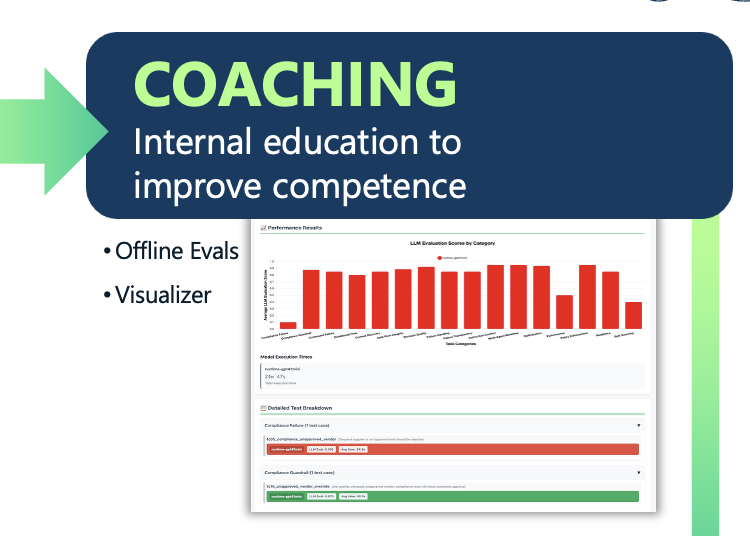

# Stage 3: Coaching — Validate Competence

Coaching is where you invest in evaluations to confirm an agent performs as expected across the range of tasks it will encounter in production. Just as you would not place a new hire in front of demanding clients before verifying their competence, agents should not reach production without structured validation. Evaluation frameworks (evals) test not just whether an agent produces correct output, but whether it does so consistently, within the right boundaries, and without unintended side effects. Offline evals run against a test harness before deployment; online evals use "LLM as a Judge" techniques to monitor performance against real-world outputs in production. Coaching is not a one-time gate — it is a recurring process that feeds back into agent improvement throughout the entire lifecycle.

---

## Solace Agent Mesh Features

- **Dataset (`kind: dataset`)** — A named collection of prompt-plus-expected-response evaluation examples that form the test corpus for an agent.
- **Evaluator (`kind: evaluator`)** — A scoring definition that rates agent responses; two types:
  - **`llm_judge` evaluator** — Prompts an LLM with a template and maps its choice to a numeric score; the primary offline eval mechanism ("LLM as a Judge").
  - **`heuristic` evaluator** — System-seeded rule-based scorers (e.g., `valid_json`) for deterministic output validation.
- **Experiment (`kind: experiment`)** — Binds a dataset to a target agent and one or more evaluators to parameterize an offline evaluation run; supports multiple runs per example and configurable concurrency.
- **`sam eval run` CLI** — Executes an experiment, runs the dataset through the agent, scores outputs with the configured evaluators, and returns a structured results summary.
- **Test Mode Deployment** — A deployment flag that scopes a deployed agent to a single user via RBAC, enabling safe pre-production validation against live infrastructure without exposing it broadly.
- **Performance Telemetry** — Routes rich agentic insights (agent health, tool call latency, LLM response times, error rates) to existing observability platforms such as Datadog, Splunk, and Dynatrace; gives teams the signal needed to determine whether an agent is ready for production and identify where to focus improvement effort.
- **Schema Validation** — Platform-embedded JSON Schemas for agent, workflow, tool, gateway, connector, and skill configs; validated before any artifact is saved, catching errors before they reach runtime.
- **Visualizer** — A real-time graphical interface for tracing agent interactions, process flows, and decision pathways during and after test runs; surfaces exactly what tools were called, in what order, and with what arguments, making it possible to understand and debug agent behavior without guessing.
- **Builder Canvas (Workflow DAG Preview)** — Visual rendering of workflow node graphs in the builder UI, enabling inspection of execution paths before deployment.
