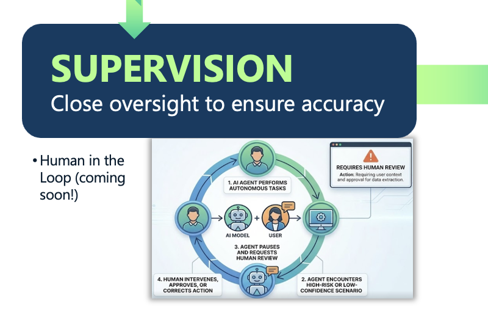

# Stage 4: Supervision — Maintain Oversight

Autonomy is the goal of agentic systems, but unsupervised autonomy in LLM-powered workflows introduces real operational risk. The supervision stage establishes the appropriate level of human oversight for each task, calibrated to its stakes and uncertainty. Human-in-the-loop (HITL) mechanisms must be treated as architectural components, not afterthoughts. Low-stakes, well-understood tasks may only require monitoring dashboards and anomaly detection. High-stakes decisions — converting emails into orders, processing insurance claims, issuing purchase orders — require explicit approval checkpoints before the agent proceeds. Agents should also be configured to recognize low-confidence or high-risk conditions and escalate proactively. Supervision is not a constraint on capability; it is the mechanism by which trust in agent capability is built incrementally and verifiably.

---

## Solace Agent Mesh Features

- **`ask_user_question` Tool** — A built-in tool the LLM calls to present structured choice-pickers and free-text inputs inline in the chat before proceeding; pauses the task and waits up to 45 minutes for a human response.
- **Tool Approval (`hil.require_approval`)** — An agent config flag that intercepts specific tool calls before dispatch and requires explicit user Approve/Deny; shows the tool name, arguments, and a configurable approval message.
- **`TaskStateInputNeeded`** — The A2A protocol task state emitted when the agent is waiting on human input; gateways forward it to the UI for rendering, ensuring the pause is visible and actionable.
- **A2UI Renderer** — The SAM UI renders all HIL surfaces inline in the chat conversation using interactive shadcn/ui components; supports choices, confirmations, and free-text inputs.
- **HIL Timeout** — Agent-side enforcement of a configurable deadline (default 45 min); on expiry the agent generates a synthetic timed-out response and the task completes with an explanation rather than hanging indefinitely.
- **RBAC Scope Enforcement** — All tool calls check required scopes against the caller's granted set before execution; peer delegation propagates the caller's identity so agents cannot launder permissions through a permitted intermediary.
