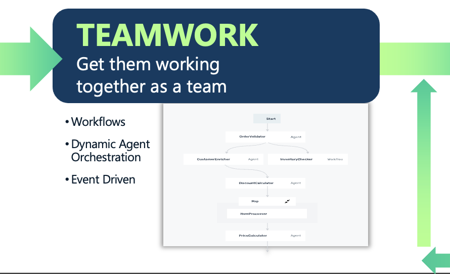

# Stage 5: Teamwork — Integrate Agents into an Ecosystem

In most enterprise deployments, an agent delivers more value as one actor within a larger mesh of agents than it ever could in isolation. The teamwork stage addresses how an agent is designed to function within the broader ecosystem — how it receives tasks, hands off results, and collaborates with peer agents across functional domains. Multi-agent architectures rely on two complementary coordination patterns: deterministic workflows, where the sequence of steps is known in advance and repeatability is paramount, and dynamic orchestration, where an orchestrator agent routes tasks and manages handoffs at runtime based on evolving context. Designing multi-agent systems is fundamentally similar to designing a high-performing organization: agents should function as a coordinated team, not just a collection of capable individuals.

---

## Solace Agent Mesh Features

- **Workflow (`kind: workflow`)** — A deterministic DAG of agent calls with explicit control flow; appears as a first-class agent on the network with five node types:
- **Peer Delegation** — Agents route sub-tasks to peer agents automatically via A2A by matching task intent to advertised Agent Card capabilities; no explicit wiring required.
- **A2A Protocol** — All inter-component communication uses the Agent-to-Agent wire format over the Solace event broker; components publish agent cards and discover each other dynamically.
- **Event Mesh Gateway** — Connects agents to real-time event streams from external systems, enabling agents to operate as autonomous, event-driven actors within the mesh.
- **Proxy (`kind: proxy`)** — Federates external A2A agents from other organizations or infrastructure into the local mesh; they appear as ordinary agents to workflows and orchestrators.
