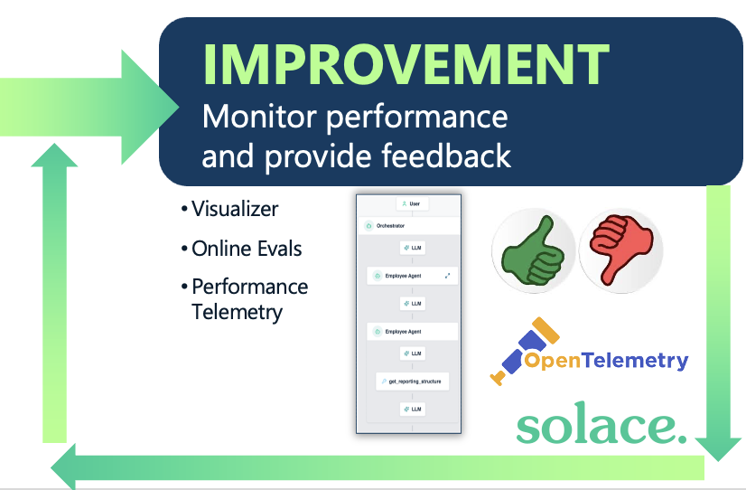

# Stage 6: Improvement — Monitor, Measure, and Iterate

Deployment is not the end of the lifecycle — it is day one of the ongoing career. The improvement stage is the feedback loop that makes agents measurably better over time, just as a performance review cycle develops junior developers into senior architects. It encompasses real-time observability of agent interactions and decision pathways, ongoing evaluation pipelines that detect performance drift before it causes damage, and structured performance reporting that surfaces trends over time. In practice this means gathering detailed telemetry on agent execution and tool calls, running online evals where an LLM compares outputs to the original mandate, collecting human feedback with thumbs up/down ratings and explanations, and using that data to generate improvements to the agent's system prompts, skills, and tool definitions. Humans act as reviewers and teachers; agentic intelligence proposes the improvements you act on.

---

## Solace Agent Mesh Features

- **Prometheus Metrics Endpoint (`GET /metrics`)** — Exposes agent runtime, broker, gateway, artifact service, and LLM client metrics; enabled via `management_server.observability.enabled: true`.
- **OTLP Metric Exporters** — Fans agent metrics out to OTLP HTTP or gRPC destinations (Datadog, New Relic, Grafana, OTel Collector) using a shared MeterProvider with a 60-second periodic flush.
- **OTLP Log Exporters** — Per-exporter log export via `slog` with per-exporter log-level filtering; additive to existing stderr/file handlers; operates independently of Prometheus.
- **Online Evals (`llm_judge`)** — The same LLM Judge evaluator used for offline coaching can be run against live production outputs to detect performance drift before it causes damage.
- **`sam eval run` CLI** — Provides structured results summaries from experiment runs; supports `runsPerExample` for statistical variation and `maxWorkers` for concurrency control.
- **Thumbs Up/Down Feedback** — Human feedback collection in the SAM UI on agent responses; surfaces trends for system prompt and skill refinement.
- **`sam config pull`** — Syncs platform state back to the local declarative config repo with credentials rewritten to `${ENV_VAR}` placeholders for safe commit; enables iterative improvement via a GitOps round-trip.
- **Deployment Checker** — A background service that periodically compares agent and gateway registries against deployment records to detect stale or silently-failed deployments.
- **Agent Reconciler** — Re-deploys all previously deployed agents and workflows on process restart, guaranteeing continuity after platform updates without manual intervention.
